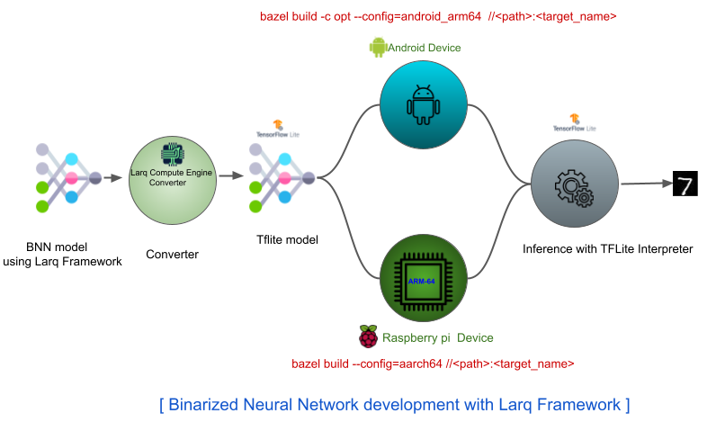

# Model Quantization with PyTorch,Tensorflow & Larq

## Overview
Quantization is the process of reducing the number of bits represents a number.
In Deep Learning, Quantization normally refers to converting from floating point to fixed point integer (i.e. 8-bit integer between 0 to 255).

Binarization means representing the number in 1 bit with {-1,1} value.

Quantization is supported in Tensorflow & PyTorch, which is normally used by many developers.However, binarization is not supported in Tensorflow & PyTorch.
But,[Larq](https://docs.larq.dev/larq/) framework supports Binarization or Binanry Neural Network.

Let's discuss how Quantzation can be done through Tensorflow & PyTorch.
Here is the directory structure of the implementation

```
Quantization
│   README.md
│
└───tensorflow
│   │   simple_network.py
│   │   tf_dnn.py
|   |   tf_ptq_dnn.py
|   |   tf_qat_dnn.py
|   |   test_tflite_model.py
│   │
│   └───tflite_c++
│   |   │
│   |   │   ...
|   |     
│   └───models
|       |  ...
|       |
|
└───pytorch
|    |   simple_network.py
|    |   pt_dnn.py
|    │   pt_ptq_dnn.py
|    |   pt_qat_dnn.py
|    |   test_accuracy.py
|    |   test_speed.py 
|    |
|    └───c++_port
|    |    |
|    |    |  ...
|    |
|    └───models
|        |
|        |  ...
|
|
└───larq
    |   simple_bnn_network
    |   lq_qat_bnn.py
    |   lq_ice_bnn_test.py
    |   lq_ice_dnn_test.py 
    └───models
    |   |   ...
    |   |
    |
    └───tflite_binary_arm64
        |  ....
        |

```
## Architecture Used

```
import tensorflow as tf

class MyNet(tf.keras.Model):
    def __init__(self, classes = 10):
        super(MyNet, self).__init__()
        self.conv1 = tf.keras.layers.Conv2D(32, (3, 3), use_bias=False)
        self.bn1 = tf.keras.layers.BatchNormalization(scale=False)
        self.max_pool1 = tf.keras.layers.MaxPooling2D((2, 2))

        self.conv2 = tf.keras.layers.Conv2D(64, (3, 3), use_bias=False)
        self.bn2 = tf.keras.layers.BatchNormalization(scale=False)
        self.max_pool2 = tf.keras.layers.MaxPooling2D((2, 2))

        self.conv3 = tf.keras.layers.Conv2D(64, (3, 3), use_bias=False)
        self.bn3 = tf.keras.layers.BatchNormalization(scale=False)
        self.flatten = tf.keras.layers.Flatten()

        self.dense1 = tf.keras.layers.Dense(64, use_bias=False)
        self.bn4 = tf.keras.layers.BatchNormalization(scale=False)
        self.dense2 = tf.keras.layers.Dense(classes, use_bias=False)
        self.bn5 = tf.keras.layers.BatchNormalization(scale=False)
        self.softmax = tf.keras.layers.Activation("softmax")

    def call(self, inputs):
        x = self.conv1(inputs)
        x = self.bn1(x)
        x = self.max_pool1(x)

        x = self.conv2(x)
        x = self.bn2(x)
        x = self.max_pool2(x)

        x = self.conv3(x)
        x = self.bn3(x)
        x = self.flatten(x)

        x = self.dense1(x)
        x = self.bn4(x)
        x = self.dense2(x)
        x = self.bn5(x)
        x = self.softmax(x)

        return x

```

## Usage:
### 1. Quantization with Tensorflow Framework
#### 1.1. PostTrainingQuantization(PTQ):

```
Run:
python3 tf_ptq_dnn.py --path models/baseline_32bit.tf

```

#### 1.2. Quantization Aware Training (QAT):

```
Run:
python3 tf_qat_dnn.py --model models/qat_dnn_8bit.tf

```


### 2. Quantization with Pytorch Framework
#### 2.1. PostTrainingQuantization(PTQ):

```
Run:
python3 pt_pqt.py --path models/32_dnn.pth

```

#### 2.2. Quantization Aware Training (QAT):

```
Run:
python3 pt_pqt.py --path models/32_dnn.pth

```

### 3. Binarization with Larq Framework

#### 3.1. Quantization Aware Training (QAT):

Architecture Used:

```
import tensorflow as tf
import larq as lq

## All quantized layers except the first will use the same options

kwargs = dict(input_quantizer="ste_sign",
              kernel_quantizer="ste_sign",
              kernel_constraint="weight_clip")

class MyBnnNet(tf.keras.Model):
    def __init__(self, classes=10):
        super(MyBnnNet, self).__init__()
        self.conv1 = lq.layers.QuantConv2D(32, (3, 3),
                                kernel_quantizer="ste_sign",
                                kernel_constraint="weight_clip",
                                use_bias=False)
        self.max_pool1 = tf.keras.layers.MaxPooling2D((2, 2))
        self.bn1 = tf.keras.layers.BatchNormalization(scale=False)

        self.conv2 = lq.layers.QuantConv2D(64, (3, 3), use_bias=False, **kwargs)
        self.max_pool2 = tf.keras.layers.MaxPooling2D((2, 2))
        self.bn2 = tf.keras.layers.BatchNormalization(scale=False)

        self.conv3 = lq.layers.QuantConv2D(64, (3, 3), use_bias=False, **kwargs)
        self.bn3 = tf.keras.layers.BatchNormalization(scale=False)
        self.flatten = tf.keras.layers.Flatten()

        self.dense1 = lq.layers.QuantDense(64, use_bias=False, **kwargs)
        self.bn4 = tf.keras.layers.BatchNormalization(scale=False)

        self.dense2 = lq.layers.QuantDense(classes, use_bias=False, **kwargs)
        self.bn5 = tf.keras.layers.BatchNormalization(scale=False)
        self.softmax = tf.keras.layers.Activation("softmax")

    def call(self, inputs):
        x = self.conv1(inputs)
        x = self.max_pool1(x)
        x = self.bn1(x)

        x = self.conv2(x)
        x = self.max_pool2(x)
        x = self.bn2(x)

        x = self.conv3(x)
        x = self.bn3(x)
        x = self.flatten(x)

        x = self.dense1(x)
        x = self.bn4(x)

        x = self.dense2(x)
        x = self.bn5(x)
        x = self.softmax(x)

        return x
```


```

python3 lq_bnn_network.py --model models/lq_qat_bnn_1bit.tf

```

#### Run 1 bit Larq Model on Raspbery-Pi target device:



Model development in our case is:

1. 1-Bit tensor flow model.
2. Convert to tflite model.
3. Convert to LCE(Larq Compute Engine) compatible tflite model.

   This tflite can be tested on raspberry-pi by using tensorflow's label_image tool.
   
   Please follow the steps mentioned inside larq/README.md file to generate "label_image"
   binary for ARM64 target.

Test the 1-bit model on the Raspberry-Pi by running the below command:

```
./label_image - tflite_model lq_qat_bnn_1bit.tflite - labels labels.txt - image <image_path> - lcompute 1

Note: must use " - lcompute 1" for using the LCE optimizer from Larq developed specifically for ARM64 device.

```

## Evaluation on Raspberry-Pi


## References:

*   https://pytorch.org/docs/stable/generated/torch.quantization.fuse_modules.html
*   https://pytorch.org/docs/stable/quantization.html
*   https://pytorch.org/blog/quantization-in-practice/
*   https://www.tensorflow.org/lite/performance/post_training_quantization
*   https://www.tensorflow.org/model_optimization/guide/quantization/training
*   https://docs.larq.dev/larq/
*   https://docs.larq.dev/compute-engine/end_to_end/
*   https://docs.larq.dev/compute-engine/build/arm/

---
Reach me @

[LinkedIn](https://www.linkedin.com/in/satya1507/) [GitHub](https://github.com/satya15july) [Medium](https://medium.com/@satya15july_11937)


